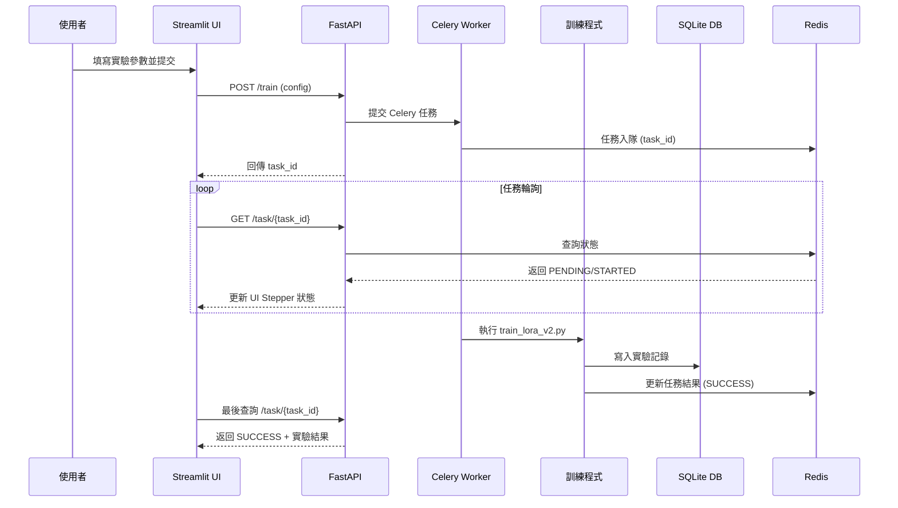
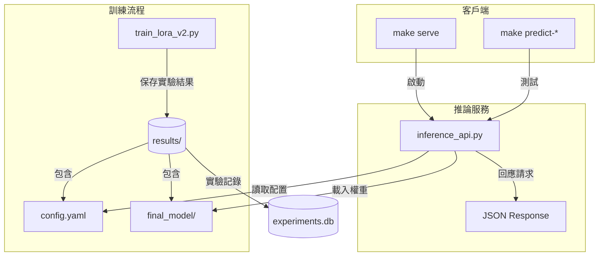

# Finetune-30-days — LoRA 訓練與實驗管理

此專案提供一個完整的 **LoRA 微調系統**，支援 M3 晶片 (MPS)、NVIDIA GPU (CUDA) 與 CPU。

**主要特點**：
- 🚀 支援同步（本地）與非同步（分散式）訓練
- 📊 完整的資料版本管理與驗證機制
- 🎯 實驗結果自動保存與追蹤
- 🌐 網頁界面支援任務提交與進度監控
- 🔄 基於 Celery + Redis 的非同步任務系統
- 📝 結構化的配置管理（Pydantic + YAML）
- ☸️ 完整的 Kubernetes 部署支援
- 🐳 優化的多階段 Docker 構建
- 📈 效能監控與分析工具

---

## 🔄 系統互動流程



## 🔄 系統架構



---

## 📂 專案結構

```
├── app/
│   ├── api.py                    # API 路由與端點定義
│   ├── config.py                 # 配置定義與驗證
│   ├── db.py                     # 資料庫模型與操作
│   ├── inference_api.py          # 情感分類推論服務
│   ├── logger_config.py          # 日誌配置與管理
│   ├── settings.py               # 系統設定與常數
│   ├── stepper_ui.py            # Streamlit UI 介面
│   ├── train_lora_v2.py         # LoRA 訓練主程式
│   ├── data_management/         # 資料管理模組
│   │   ├── data_validator.py    # 資料集驗證與品質檢查
│   │   ├── dataset_analyzer.py  # 資料集分布與統計分析
│   │   └── version_manager.py   # 資料集版本與變更追蹤
│   ├── monitoring/             # 監控模組
│   │   └── performance.py      # 系統效能與資源監控
│   ├── tools/                  # 工具模組
│   │   └── analyze_metrics.py  # 實驗指標分析工具
│   └── train_lora_v2.py        # LoRA 訓練主程式
├── config/                      # 配置文件目錄
│   ├── default.yaml           # 預設訓練配置
│   ├── albert.yaml            # Albert 模型配置
│   ├── bert_chinese.yaml      # 中文 BERT 配置
│   ├── distilbert_optimized.yaml  # 優化的 DistilBERT 配置
│   └── roberta.yaml           # RoBERTa 模型配置
├── results/                     # 實驗結果目錄
│   └── {實驗名稱}/            # 獨立實驗目錄
│       ├── config.yaml        # 實驗完整配置
│       ├── metrics.json       # 訓練評估指標
│       ├── logs.txt          # 訓練日誌
│       └── artifacts/        # 模型與檢查點
│           ├── checkpoint-*/ # 訓練中間檢查點
│           └── final_model/  # 最終訓練模型
├── data/                      # 資料集目錄
│   ├── datasets/             # 訓練資料集
│   └── metadata/             # 資料集元資料
├── requirements.txt           # Python 依賴清單
├── Makefile                  # 專案管理指令
└── README.md                 # 專案說明文件
```

---

## 🚀 快速開始

### 環境設置

1. **複製環境變數文件**：
   ```bash
   cp .env.example .env
   ```

2. **編輯環境變數**（可選）：
   ```bash
   # 編輯 .env 文件來自定義配置
   nano .env
   ```

   主要配置項目：
   - `REDIS_PORT`: Redis 端口（預設：6379）
   - `API_PORT`: API 服務端口（預設：8000）
   - `UI_PORT`: UI 界面端口（預設：8501）
   - `TZ`: 時區設定（預設：Asia/Taipei）

### 部署方式

1. **本地直接訓練**：
```bash
make setup-conda   # 建立 Conda 環境（自動偵測 GPU/MPS/CPU）
make run-local     # 使用預設配置開始訓練
make logs-local    # 查看訓練進度
```

2. **Docker 容器部署**：
```bash
# 啟動所有服務
make start-services  # 啟動 Redis、Worker、API、UI 服務

# 使用網頁界面（推薦）
# 訪問 http://localhost:8501
```

3. **Kubernetes 部署**（新增）：
```bash
# 快速部署（開發環境）
make k8s-quick-deploy  # 一鍵部署（建構+部署）

# 開啟服務訪問
make k8s-port-forward  # 轉發服務端口到本地

# 監控與管理
make k8s-dashboard    # 開啟 K8s 儀表板
make k8s-status       # 查看部署狀態
make k8s-logs service=worker  # 查看特定服務日誌

# 擴展服務
make k8s-scale service=worker replicas=3  # 調整 worker 數量
```

> 💡 **服務說明**：
> - **Redis (localhost:6379)**：任務佇列與結果存儲
> - **FastAPI (localhost:8000)**：REST API 服務
> - **Streamlit UI (localhost:8501)**：網頁操作界面
>   - 支援所有 default.yaml 中的參數配置
>   - 直接傳遞訓練配置（不再使用臨時文件）
>   - 即時顯示訓練進度（每 2 秒更新）
>   - 實驗記錄查看與管理

### 自定義訓練

1. **使用效能監控**：
   在訓練過程中自動啟用 `PerformanceMonitor` 以收集系統和訓練指標。

2. **分析實驗數據**：
   使用 `analyze_metrics.py` 來生成實驗比較報告。
   ```bash
   make analyze-by-model
   ```

3. **修改預設配置**：
   直接編輯 `config/default.yaml`

4. **使用命令列參數**：
   ```bash
   python app/train_lora_v2.py \
     --experiment_name "custom_test" \
     --learning_rate 0.001 \
     --epochs 3 \
     --train_samples 1000
   ```

### 常用參數

```yaml
# 在 config/default.yaml 中可調整：

model:
  name: "distilbert-base-uncased"
  num_labels: 2

training:
  learning_rate: 5.0e-4
  num_train_epochs: 1
  per_device_train_batch_size: 2

lora:
  r: 8
  lora_alpha: 16
  target_modules: ["q_lin", "v_lin"]
  lora_dropout: 0.1
```

---

## 📊 實驗管理

### 實驗目錄結構

每次訓練會自動創建實驗專屬目錄：
```
results/
└── {實驗名稱}/             # 實驗目錄
    ├── config.yaml         # 實驗配置（含基礎模型設定）
    ├── metrics.json        # 評估指標
    └── artifacts/
        └── final_model/    # 訓練完成的模型（LoRA 權重）
```

- **系統日誌**：記錄設備、模型載入、資料處理等系統操作
- **訓練進度**：記錄每個步驟的損失值、學習率、評估指標等
- **實驗配置**：包含所有參數設定，確保實驗可重現
- **評估指標**：保存最終的訓練時間、準確率等結果

### 實驗追蹤

提供多種方式查看實驗記錄：

1. **網頁界面**（推薦）：
   - 訪問 http://localhost:8501
   - 切換到「實驗記錄」頁籤
   - 支援篩選、排序、統計功能
   - 即時更新實驗狀態

2. **命令列工具**：
   ```bash
   # 查看實驗記錄（表格形式）
   make db-list
   
   # 查看最新實驗的訓練進度
   make logs-local
   ```

3. **REST API**：
   ```bash
   # 列出所有實驗（支援篩選和排序）
   curl "http://localhost:8000/experiments?min_accuracy=0.8&sort_by=eval_accuracy&desc=true"

   # 查詢單一實驗
   curl http://localhost:8000/experiments/{experiment_id}

   # 獲取實驗統計
   curl http://localhost:8000/experiments/stats
   ```

   支援的篩選條件：
   - `name`：實驗名稱（模糊匹配）
   - `min_accuracy`：最低準確率
   - `max_runtime`：最長訓練時間
   - `start_date`/`end_date`：時間範圍
   - `sort_by`：排序欄位（created_at/name/train_runtime/eval_accuracy）
   - `desc`：是否降序排序
   - `limit`：返回數量限制

### 效能監控與分析
本專案提供了強大的效能監控與分析工具，幫助用戶追蹤訓練過程中的系統資源使用情況和模型性能。
`performance.py` 提供了 `PerformanceMonitor` 類，用於收集 CPU、記憶體使用率以及訓練過程中的 token 處理速度。
`analyze_metrics.py` 提供了分析工具，能夠從多個實驗中提取數據並生成比較報告。

---

## 🔧 資料管理工具

以下指令使用預設的 SST-2 範例資料集，僅供開發測試用途。
實際訓練時，這些功能已整合在訓練流程中自動執行。

```bash
make data-analyze    # 分析標籤分布
make data-validate   # 驗證資料品質
make data-versions   # 管理資料版本
```

**資料驗證報告範例**：
```json
{
  "total_samples": 500,
  "label_counts": {"0": 245, "1": 255},
  "imbalance_ratio": 1.04,
  "is_balanced": true
}
```

---

## 💡 注意事項

### 環境設置
- 首次使用請執行 `make setup-conda` 設置環境
- 使用 `make help` 查看完整的命令說明
- 支援 Docker 和 Kubernetes 部署
- 環境變數配置：複製 `.env.example` 到 `.env` 並根據需要調整

### Docker 與 Kubernetes
- 使用多階段構建優化映像大小和構建速度
- 支援快速構建（開發用）和完整構建（生產用）
- Kubernetes 部署提供完整的服務管理功能
- 使用 `make k8s-port-forward` 簡化服務訪問

### 訓練與配置
- 實驗配置會自動保存，方便追蹤和重現
- 資料管理功能在訓練時自動執行，確保資料品質
- 訓練結果統一保存在 `results/` 目錄
- 支援直接傳遞訓練配置，無需臨時文件

### 非同步服務
- 支援 Docker Compose 和 Kubernetes 兩種部署方式
- 提供完整的服務監控和管理功能
- 建議使用網頁界面操作，API 接口主要用於程式整合
- 服務端口可通過 `.env` 文件自定義調整


### 推論服務

本專案提供輕量級的情感分類推論服務，支援多種預訓練模型：

- distilbert-base-uncased（英文，輕量級）
- roberta-base（英文，高性能）
- albert-base-v2（英文，輕量級）
- bert-base-chinese（中文）

1. **啟動服務**：
```bash
# 使用最新實驗的模型
make serve

# 或指定特定實驗
make serve exp=default_experiment_20250911_233842
```

2. **測試預測**：
```bash
# 檢查服務狀態
make predict-health

# 測試自訂文本
make predict-text text='This movie was great!'

# 使用預設範例
make predict-positive  # 測試正面評論
make predict-negative  # 測試負面評論
```

### 回應格式

```json
{
    "label": 1,                    # 1 = positive, 0 = negative
    "probability": 0.9983,         # prediction confidence
    "latency_ms": 25.4,           # processing time (ms)
    "base_model": "distilbert-base-uncased",  # base model name
    "language": "English"          # model language
}
```

### 注意事項

1. **模型選擇**：
   - 英文文本請使用英文模型（distilbert/roberta/albert）
   - 中文文本請使用中文模型（bert-base-chinese）
   - 注意文本語言要和模型語言匹配

2. **服務配置**：
   - 服務運行在 8002 端口
   - 自動檢測並使用 MPS（Apple Silicon）或 CPU
   - 支援模型熱切換（不需重啟服務）
