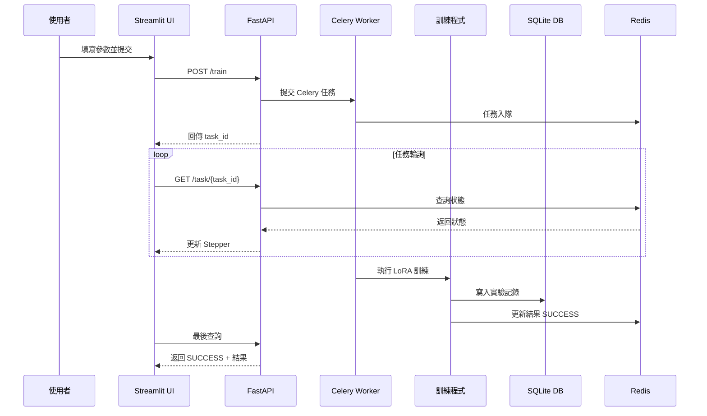
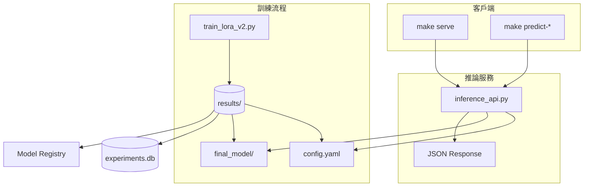

# 📘 Finetune-30-days — LoRA 訓練與實驗管理

本專案提供一個完整的 **LoRA 微調平台**，支援 **M3 晶片 (MPS)**、**NVIDIA GPU (CUDA)** 與 **CPU**。
從 **資料驗證 → 訓練 → 實驗管理 → 部署 → 監控**，打造一條龍的 AI 微調系統。

---

## ✨ 主要特色

* 🚀 **多硬體支援**：CPU / CUDA / Apple MPS
* 📊 **資料管理**：驗證、版本追蹤、分布分析
* 🎯 **實驗追蹤**：自動保存配置、日誌、metrics
* 🌐 **網頁界面**：提交任務、即時監控、實驗瀏覽
* 🔄 **非同步任務**：Celery + Redis 任務隊列
* 📝 **結構化配置**：Pydantic + YAML 管理
* ☸️ **Kubernetes 支援**：PodSpec、擴縮容、監控
* 🐳 **Docker 化部署**：多階段構建、Compose、K8s
* 📈 **效能監控**：tokens/sec、CPU/Mem 使用率
* 🔐 **安全性**：JWT 認證、RBAC 權限控管
* 📋 **審計日誌**：完整操作追蹤
* 🧪 **測試完整**：單元測試 + 錯誤處理驗證
* 🏗️ **模組化架構**：清晰職責分離，方便擴展與維護
* 📦 **模型共享與推薦**

---

## 🔄 系統互動流程



---

## 🏗️ 系統架構



---

## 🔐 認證與授權 (JWT + RBAC)

* **JWT 驗證**：登入後獲取 token，後續 API 請求需附帶
* **三層權限控制**：

  1. `get_current_user` → 驗證 Token
  2. `check_admin` → 管理員專屬端點
  3. `check_task_owner` → 使用者僅能存取自己任務

### API 權限對照

| 端點                | 方法   | 權限    | 模組             |
| ----------------- | ---- | ----- | -------------- |
| `/login`          | POST | 公開    | auth.py        |
| `/train`          | POST | 已認證   | train.py       |
| `/task/{task_id}` | GET  | 任務所有者 | task.py        |
| `/experiments`    | GET  | 管理員   | experiments.py |
| `/audit/logs`     | GET  | 管理員   | audit.py       |

---

## 📂 專案結構 (精簡版)

```
app/
├── main.py              # FastAPI 主應用
├── auth/                # 認證授權
│   └── jwt_utils.py
├── api/routes/          # API 路由
│   ├── auth.py
│   ├── train.py
│   ├── task.py
│   ├── experiments.py
│   └── audit.py
├── tasks/               # 任務處理
│   ├── training.py
│   └── inference.py
├── data/                # 資料管理
│   ├── validation.py
│   ├── analysis.py
│   └── versioning.py
├── monitor/             # 效能 & 審計
│   ├── logging_utils.py
│   ├── system_metrics.py
│   └── audit_utils.py
├── train/               # 訓練模組
│   ├── preprocess.py
│   ├── runner.py
│   └── evaluator.py
├── models/              # 模型卡與註冊
│   └── model_registry.py
├── tools/               # 工具
│   ├── analyze_metrics.py
│   └── checkpoint_manager.py
config/                  # 訓練配置 (YAML)
results/                 # 實驗結果 (metrics, logs, model)
tests/                   # 單元與整合測試
k8s/                     # Kubernetes 部署配置
```

---

## 🚀 快速開始

### 1. 環境設置

```bash
cp .env.example .env
make setup-conda
```

### 2. 本地訓練

```bash
make run-local   # 啟動訓練
make logs-local  # 查看日誌
```

### 3. Docker 部署

```bash
make start-services   # 啟動 Redis + Worker + API + UI
```

### 4. Kubernetes 部署

```bash
make k8s-quick-deploy
make k8s-port-forward
```

---

## 🧪 測試開發

```bash
make test      # 運行所有測試
make test-v    # 顯示詳細過程
```

測試範圍：

* API 基本功能 / 錯誤處理
* 資料集驗證 / 超長序列 / OOM
* JWT 認證與 RBAC 權限檢查
* 審計日誌保存與查詢
* Celery retry / Checkpoint 清理

---

## 📊 實驗管理

* 訓練結果統一存放於 `results/`

* 自動保存：

  * `config.yaml` → 完整配置
  * `metrics.json` → 效能與準確率
  * `logs.txt` → 訓練日誌
  * `artifacts/` → 模型與 checkpoints

* **Checkpoint 清理策略**：

  * 保留「最佳」、「最後」、「最快」三個 checkpoint
  * 其餘自動刪除

* **瀏覽方式**：

  * Web UI（實驗記錄頁面）
  * CLI (`make db-list`)
  * API (`/experiments`)

---

## 🔎 推論服務

支援多模型情感分類：

* distilbert-base-uncased (英文, 輕量)
* roberta-base (英文, 高性能)
* albert-base-v2 (英文, 輕量)
* bert-base-chinese (中文)

### 使用方式

```bash
make serve                      # 使用最新實驗
make serve exp=my_experiment    # 指定實驗

make predict-health             # 檢查服務狀態
make predict-text text='Great!'
make predict-positive
make predict-negative
```

回應格式：

```json
{
  "label": 1,
  "probability": 0.9983,
  "latency_ms": 25.4,
  "base_model": "distilbert-base-uncased",
  "language": "English"
}
```

---

## 📌 注意事項

* 環境變數 `.env` 可調整 Redis / API / UI 端口
* 支援 Docker Compose + K8s 部署
* 請使用 HTTPS（生產環境）
* 建議透過 Web UI 操作，API 提供程式整合
