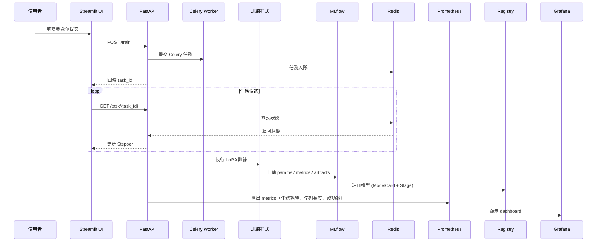

# 📘 Finetune-30-days — LoRA 訓練與實驗管理

本專案提供一個完整的 **LoRA 微調平台**，支援 **M3 晶片 (MPS)**、**NVIDIA GPU (CUDA)** 與 **CPU**。
從 **資料驗證 → 訓練 → 實驗管理 → 模型共享 → 部署 → 監控**，打造一條龍的 AI 微調系統。

---

## ✨ 主要特色

* 🚀 **多硬體支援**：CPU / CUDA / Apple MPS
* 📊 **資料管理**：驗證、版本追蹤、分布分析
* 🎯 **實驗追蹤**：整合 MLflow，統一紀錄參數 / 指標 / 成品
* 📦 **模型共享與推薦**：建立 Model Card、提供搜尋與推薦 API
* 🧾 **模型治理**：整合 MLflow Registry，支援 Staging / Production / Archived 階段
* ☸️ **Kubernetes + Helm 部署**：模組化 chart、values 檔案分層
* 🧰 **CI/CD 自動化**：GitHub Actions + Docker + Helm dry-run
* 📈 **可觀測性監控**：Prometheus Exporter + Grafana Dashboard
* 🌐 **網頁界面**：提交任務、即時監控、實驗瀏覽
* 🔄 **非同步任務**：Celery + Redis 任務隊列
* 🔐 **安全性**：JWT 認證、RBAC 權限控管
* 📋 **審計日誌**：完整操作追蹤
* 🧪 **測試完整**：單元測試 + 錯誤處理驗證
* 🏗️ **模組化架構**：清晰職責分離，方便擴展與維護

---

## 🔄 系統互動流程



---

## 🏗️ 系統架構

```mermaid
graph TB
    subgraph Training["訓練流程"]
        Train[train_lora_v2.py] --> Results[(results/)]
        Train --> MLflow[MLflow Tracking]
        MLflow --> Registry[MLflow Registry]
        Registry --> ModelCard[ModelCard JSON]
        Results --> Config[config.yaml]
        Results --> Model[final_model/]
    end

    subgraph Monitoring["監控系統"]
        Exporter[Prometheus Exporter] --> P[Prometheus Server]
        P --> G[Grafana Dashboard]
    end

    subgraph CI/CD["部署自動化"]
        GH[GitHub Actions] --> Build[Docker Build]
        Build --> HelmDryRun[Helm dry-run]
        Build --> Push[DockerHub Push (tag=day-*)]
    end
```

---

## 🔐 認證與授權 (JWT + RBAC)

* **JWT 驗證**：登入後獲取 token，後續 API 請求需附帶
* **三層權限控制**：

  1. `get_current_user` → 驗證 Token
  2. `check_admin` → 管理員專屬端點
  3. `check_task_owner` → 使用者僅能存取自己任務

### API 權限對照

| 端點                | 方法   | 權限    | 模組             |
| ----------------- | ---- | ----- | -------------- |
| `/login`          | POST | 公開    | auth.py        |
| `/train`          | POST | 已認證   | train.py       |
| `/task/{task_id}` | GET  | 任務所有者 | task.py        |
| `/experiments`    | GET  | 管理員   | experiments.py |
| `/mlflow`         | GET  | 公開    | mlflow.py      |
| `/audit/logs`     | GET  | 管理員   | audit.py       |

---

## 📂 專案結構 (精簡版)

```
app/
├── main.py              # FastAPI 主應用
├── auth/                # 認證授權
│   └── jwt_utils.py
├── api/routes/          # API 路由
│   ├── auth.py
│   ├── train.py
│   ├── task.py
│   ├── experiments.py
│   ├── mlflow.py         # MLflow 實驗追蹤
│   └── audit.py
├── tasks/               # 任務處理
│   ├── training.py
│   └── inference.py
├── data/                # 資料管理
│   ├── validation.py
│   ├── analysis.py
│   └── versioning.py
├── monitor/             # 效能 & 審計
│   ├── logging_utils.py
│   ├── system_metrics.py
│   └── audit_utils.py
├── train/               # 訓練模組
│   ├── preprocess.py
│   ├── runner.py
│   └── evaluator.py
├── models/              # 模型卡與註冊
│   └── model_registry.py
├── tools/               # 工具
│   ├── analyze_metrics.py
│   └── checkpoint_manager.py
config/                  # 訓練配置 (YAML)
results/                 # 實驗結果 (metrics, logs, model)
tests/                   # 單元與整合測試
k8s/                     # Kubernetes 部署配置
```

---

## 🚀 快速開始

### 1. 環境設置

```bash
cp .env.example .env
make setup-conda
```

### 2. 本地訓練

```bash
make run-local   # 啟動訓練
make logs-local  # 查看日誌
```

### 3. Docker 部署

```bash
make start-services   # 啟動 Redis + Worker + API + UI
```

### 4. Kubernetes 部署

```bash
make k8s-quick-deploy
make k8s-port-forward
```

---

## 🧪 測試開發

```bash
make test      # 運行所有測試
make test-v    # 顯示詳細過程
```

測試範圍：

* API 基本功能 / 錯誤處理
* 資料集驗證 / 超長序列 / OOM
* JWT 認證與 RBAC 權限檢查
* 審計日誌保存與查詢
* Celery retry / Checkpoint 清理

---

## 📊 實驗管理

* 訓練結果統一存放於 `results/`

* 自動保存：

  * `config.yaml` → 完整配置
  * `metrics.json` → 效能與準確率
  * `logs.txt` → 訓練日誌
  * `artifacts/` → 模型與 checkpoints
  * MLflow 追蹤：
    * 參數：batch_size、learning_rate、epochs 等
    * 指標：accuracy、loss、runtime
    * 成品：模型、配置、日誌

* **Checkpoint 清理策略**：

  * 保留「最佳」、「最後」、「最快」三個 checkpoint
  * 其餘自動刪除

* **瀏覽方式**：

  * Web UI（實驗記錄頁面）
  * MLflow UI（詳細實驗追蹤）
  * CLI (`make db-list`)
  * API (`/experiments`, `/mlflow`)

---

## 🔎 推論服務

支援多模型情感分類：

* distilbert-base-uncased (英文, 輕量)
* roberta-base (英文, 高性能)
* albert-base-v2 (英文, 輕量)
* bert-base-chinese (中文)

### 使用方式

```bash
make serve                      # 使用最新實驗
make serve exp=my_experiment    # 指定實驗

make predict-health             # 檢查服務狀態
make predict-text text='Great!'
make predict-positive
make predict-negative
```

回應格式：

```json
{
  "label": 1,
  "probability": 0.9983,
  "latency_ms": 25.4,
  "base_model": "distilbert-base-uncased",
  "language": "English"
}
```

---

## 📦 模型共享與推薦（Model Registry）

每個訓練完成的模型都會自動生成一份 **Model Card**，
以 JSON 形式儲存於 `data/model_registry/`，包含：

* `base_model`, `language`, `task`, `description`, `metrics`, `tags`
* 選用 `embedding` 向量，支援語義推薦 (semantic search)

### 🔍 主要 API

| 端點                   | 方法   | 說明                                                     |
| -------------------- | ---- | ------------------------------------------------------ |
| `/models/search`     | GET  | 根據 base_model / 語言 / 任務 / 標籤 搜尋模型                      |
| `/models/recommend`  | POST | 根據 embedding 相似度推薦模型                                   |
| `/models/transition` | POST | 管理 MLflow Registry 的階段切換 (Staging→Production→Archived) |

👉 未來會支援 **自然語言查詢模型推薦**，自動將文字 query 轉換為 embedding。

---

## 🧾 實驗追蹤與治理（MLflow Tracking + Registry）

整合 **MLflow Tracking**：

* 自動記錄 `params / metrics / artifacts`。
* 可從 MLflow UI 直接比對 run 曲線。
* 提供 API `/experiments/mlflow/{run_id}` 查詢結果。

整合 **MLflow Registry**：

* 每個模型以 `run_id` 精確對應版本。
* 階段 (Stage)：`Staging`、`Production`、`Archived`。
* 自動歸檔舊 Production 模型，確保只有一個上線版本。
* ModelCard 狀態與 MLflow Registry 完全同步。

---

## ☸️ Helm 部署與多環境設定

Helm Chart 結構：

```
charts/finetune-platform/
├── Chart.yaml
├── values.yaml
├── values.prod.yaml
└── templates/
    ├── api-deployment.yaml
    ├── worker-deployment.yaml
    ├── redis-statefulset.yaml
    ├── ui-deployment.yaml
    ├── secret.yaml
    ├── service.yaml
    └── _helpers.tpl
```

* `values.yaml` 為預設開發配置
* `values.prod.yaml` 用於正式環境覆蓋設定
* `secrets:` 區塊集中管理敏感資訊（如 `JWT_SECRET`）

部署範例：

```bash
# 開發環境
helm install finetune charts/finetune-platform -f values.yaml

# 正式環境
helm upgrade finetune charts/finetune-platform -f values.yaml -f values.prod.yaml
```

---

## 🔄 CI/CD 工作流程（GitHub Actions）

自動化流程設計：

| 分支 / Tag        | 執行內容                         | 說明             |
| --------------- | ---------------------------- | -------------- |
| **所有分支 / PR**   | Lint + Test                  | 基礎品質檢查         |
| **main 分支**     | Lint + Test + Helm dry-run   | 驗證 Chart 可正確部署 |
| **tag = day-*** | Build + Push + Deploy (echo) | 模擬發版流程         |

Workflow 範例（`ci.yml`）：

```yaml
on:
  push:
    branches: ['**']
    tags: ['day-*']
  pull_request:
    branches: ['**']
```

👉 在 GitHub Actions 會看到：

* ✅ Lint + Test：單元測試全部通過
* 🧱 Helm dry-run：顯示「部署模擬成功」
* 📦 tag 發版（day-*）會顯示「Docker Push 模擬完成」

---

## 📊 可觀測性：Prometheus + Grafana

平台導入 Prometheus Exporter，暴露 `/metrics` 端點，
由 Grafana 定期抓取數據生成儀表板。

### 指標一覽

| 指標名稱                                                  | 說明        |
| ----------------------------------------------------- | --------- |
| `task_success_total`, `task_failure_total`            | 任務成功與失敗計數 |
| `task_queue_length`                                   | 目前待處理任務數  |
| `task_duration_seconds`                               | 任務耗時直方圖   |
| `system_cpu_percent`, `system_memory_usage_gigabytes` | 系統資源使用情況  |

### Grafana Dashboard

| 圖表名稱        | 查詢公式                                                                        | 監控目的     |
| ----------- | --------------------------------------------------------------------------- | -------- |
| 任務成功 / 失敗計數 | `increase(task_success_total[5m])`, `increase(task_failure_total[5m])`      | 觀察任務結果變化 |
| 任務佇列長度      | `task_queue_length`                                                         | 檢查系統壅塞情況 |
| 平均任務耗時      | `rate(task_duration_seconds_sum[5m])/rate(task_duration_seconds_count[5m])` | 追蹤任務效能   |
| CPU 使用率     | `max(system_cpu_percent)`                                                   | 檢視系統負載   |
| 記憶體使用量      | `max(system_memory_usage_gigabytes)`                                        | 追蹤記憶體健康度 |

---

## 📌 注意事項

* 環境變數 `.env` 可調整 Redis / API / UI 端口
* 建議在生產環境使用 Helm Chart + CI/CD
* Prometheus/Grafana 可透過 `values.monitoring.yaml` 擴充
* MLflow、Registry、Exporter 須配合 Volume/Port 開放
* 請使用 HTTPS（生產環境）