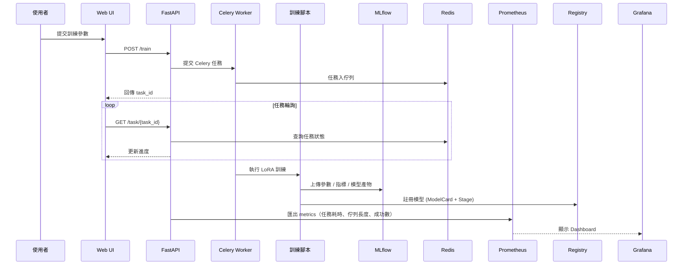

# 🧠 Finetune Platform — 端到端 LoRA 訓練與實驗管理平台

> 一個以 **FastAPI、Celery、Redis、MLflow、Kubernetes** 打造的生產級 LoRA 微調與實驗治理平台。
>
> 支援從 **資料驗證 → 模型訓練 → 實驗追蹤 → 模型治理 → 部署監控** 的完整生命週期。

---

## ✨ 主要特色

* 🚀 **多硬體支援** — 同時支援 CPU、NVIDIA CUDA 與 Apple MPS (M3 晶片)
* 📊 **資料管理** — 提供資料驗證、版本追蹤與分布分析
* 🎯 **實驗追蹤 (Experiment Tracking)** — 整合 MLflow，自動記錄參數、指標與模型產物
* 📦 **模型卡與推薦 (Model Registry & Recommendation)** — 自動生成 Model Card，支援搜尋與語義推薦
* 🧾 **模型治理 (Model Governance)** — 整合 MLflow Registry，支援 Staging / Production / Archived 階段
* ☸️ **Kubernetes + Helm 部署** — 模組化 Helm Chart，支援多環境配置 (`values.yaml`, `values.prod.yaml`)
* 🧰 **CI/CD 自動化** — GitHub Actions + Docker + Helm Dry-run 完整流程
* 📈 **系統監控與可觀測性** — Prometheus Exporter + Grafana Dashboard
* 🌐 **網頁操作介面** — 支援任務提交、進度監控、實驗瀏覽
* 🔄 **非同步任務排程** — Celery + Redis 任務佇列
* 🔐 **安全機制與權限控管** — JWT 驗證 + RBAC 角色管理
* 🧾 **操作審計日誌 (Audit Logging)** — 完整 API 操作追蹤
* 🧪 **測試覆蓋完整** — 單元測試 + 錯誤處理驗證
* 🏗️ **模組化架構設計** — 清晰職責分離，易於維護與擴充

---

## 🔄 系統互動流程



---

## 🏗️ 系統架構圖

```
graph TB
    subgraph Training["訓練流程"]
        Train[train_lora_v2.py] --> MLflow[MLflow Tracking]
        MLflow --> Registry[MLflow Registry]
        Registry --> ModelCard[ModelCard JSON]
        Train --> Results[(results/)]
        Results --> Config[config.yaml]
        Results --> Model[final_model/]
    end

    subgraph Monitoring["監控系統"]
        Exporter[Prometheus Exporter] --> P[Prometheus Server]
        P --> G[Grafana Dashboard]
    end

    subgraph CI/CD["自動化部署流程"]
        GH[GitHub Actions] --> Build[Docker Build]
        Build --> HelmDryRun[Helm dry-run]
        Build --> Push[DockerHub Push (tag=day-*)]
    end
```

---

## 📦 模型卡與推薦 (Model Registry & Recommendation)

每次訓練完成後，系統會自動生成一份 **Model Card (JSON)**，
儲存在 `data/model_registry/`，內容包含：

* `base_model`, `language`, `task`, `description`, `metrics`, `tags`
* 可選用 `embedding` 向量，用於語義相似度搜尋（semantic search）

### 🔍 主要 API

| Endpoint             | 方法   | 功能說明                                    |
| -------------------- | ---- | --------------------------------------- |
| `/models/search`     | GET  | 依 base_model / 語言 / 任務 / 標籤 搜尋模型        |
| `/models/recommend`  | POST | 根據 embedding 相似度推薦模型                    |
| `/models/transition` | POST | 控管模型階段（Staging → Production → Archived） |

> 未來將支援 **自然語言查詢推薦**，自動將文字查詢轉換為向量進行語義比對。

---

## 🧾 實驗追蹤與模型治理 (Experiment Tracking & Model Governance)

### **MLflow Tracking**

* 自動記錄訓練參數 (`params`)、指標 (`metrics`) 與模型產物 (`artifacts`)
* 可於 MLflow UI 比較不同實驗的曲線
* 提供 API `/experiments/mlflow/{run_id}` 查詢詳細結果

### **MLflow Registry**

* 每個模型以 `run_id` 對應唯一版本
* 階段管理：`Staging`、`Production`、`Archived`
* 自動歸檔舊 Production 模型，確保僅保留最新上線版本
* Model Card 與 Registry 狀態完全同步

---

## ☸️ Helm 部署

**Chart 結構**

```
charts/finetune-platform/
├── Chart.yaml
├── values.yaml
├── values.prod.yaml
└── templates/
    ├── api-deployment.yaml
    ├── worker-deployment.yaml
    ├── redis-statefulset.yaml
    ├── ui-deployment.yaml
    ├── secret.yaml
    ├── service.yaml
    └── _helpers.tpl
```

**部署範例**

```bash
# 開發環境
helm install finetune charts/finetune-platform -f values.yaml

# 正式環境
helm upgrade finetune charts/finetune-platform -f values.yaml -f values.prod.yaml
```

---

## 🔄 CI/CD 自動化流程（GitHub Actions）

| 分支 / Tag      | 執行內容                         | 說明                  |
| ------------- | ---------------------------- | ------------------- |
| 任意分支 / PR     | Lint + Test                  | 程式碼品質與測試驗證          |
| `main` 分支     | Lint + Test + Helm Dry-Run   | 驗證 Helm Chart 可正確部署 |
| `tag = day-*` | Build + Push + Deploy (echo) | 模擬發版流程              |

### **流程亮點**

* ✅ Lint + Test：確保程式碼品質與單元測試完整性
* 🧱 Helm Dry-run：模擬部署模板的正確性
* 📦 Tag 發版：自動建置並推送 Docker 映像

---

## 📊 可觀測性與監控 (Prometheus + Grafana)

平台內建 **Prometheus Exporter**，提供 `/metrics` 端點，
由 Prometheus 定期抓取，並於 Grafana Dashboard 視覺化顯示。

### **指標一覽**

| 指標名稱                                       | 說明                       |
| ------------------------------------------ | ------------------------ |
| `task_success_total`, `task_failure_total` | 累計任務成功與失敗數               |
| `task_queue_length`                        | 當前待處理任務數量                |
| `task_duration_seconds`                    | 任務執行耗時直方圖                |
| `system_cpu_percent`                       | API / Worker CPU 使用率 (%) |
| `system_memory_usage_gigabytes`            | 記憶體使用量 (GB)              |

### **Grafana 圖表**

| 圖表名稱        | 查詢公式                                                                        | 目的       |
| ----------- | --------------------------------------------------------------------------- | -------- |
| 任務成功 / 失敗計數 | `increase(task_success_total[5m])`                                          | 觀察任務結果變化 |
| 任務佇列長度      | `task_queue_length`                                                         | 偵測系統壅塞情況 |
| 平均任務耗時      | `rate(task_duration_seconds_sum[5m])/rate(task_duration_seconds_count[5m])` | 追蹤任務效能   |
| CPU 使用率     | `max(system_cpu_percent)`                                                   | 檢查系統負載   |
| 記憶體使用量      | `max(system_memory_usage_gigabytes)`                                        | 監控資源健康度  |

---

## ⚙️ 部署與設定注意事項

* `.env` 檔可設定 Redis / API / UI 服務埠
* 建議於生產環境使用 **Helm + CI/CD 自動化流程**
* Prometheus / Grafana 可透過 `values.monitoring.yaml` 擴充
* MLflow、Registry、Exporter 須配置對應 Volume 與 Port
* 生產環境請使用 **HTTPS**